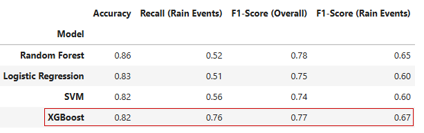

# 🌧️ Rainfall Prediction Model

A machine learning project that predicts next-day rainfall using historical weather data.  

## 🚀 The Result

By specializing this model for the **Melbourne region** and implementing **KNN Imputation**, this project achieved a **76% Recall rate** for rain events—a **46% improvement** over the Random Forest baseline.

## 🛠️ Key Technical Features

* **Data Rescue:** Used K-Nearest Neighbors (KNN) Imputation (*k=5*) to recover missing climatic variables (Sunshine, Evaporation, Cloud Cover), increasing the usable dataset by **11.7%**.
* **Localized Precision:** Narrowed scope to the Melbourne sub-region to capture specific coastal weather patterns.
* **Imbalance Management:** Utilized `scale_pos_weight` in XGBoost to prioritize identifying rain events (minority class) over raw accuracy.
* **Production-Ready Pipeline:** Integrated all preprocessing, scaling, and imputation into a single Scikit-Learn `Pipeline` to prevent data leakage.

## 🎯 Model Performance Comparison

 

## 🔗 Related Notebook
[View Full Analysis Notebook](./rainfall-prediction-model.ipynb)

---

## 📌 Objective

The goal of this project is to develop a classification model that can accurately predict rainfall events, with a focus on handling class imbalance and evaluating model performance using appropriate metrics.

## 📊 Dataset
* Source: Melbourne weather dataset (historical observations)
* Dataset consists of **8,443** observations from the Melbourne region, featuring a significant class imbalance (**~24%** rain events vs. ~76% non-rain events).
* Features include:
    - Temperature
    - Humidity
    - Pressure
    - Wind direction and speed
    - Rainfall indicators

## 🔍 Approach

The project follows an end-to-end data science workflow:

1. Data Preparation
    - Data cleaning and preprocessing
    - Handling missing values
    - Feature selection and transformation
2. Exploratory Data Analysis (EDA)
    - Identified key relationships between weather variables and rainfall
    - Filtered the data for target geographical area.
3. Data Imputation
    - Used KNN imputation to address missing data for features sunshine and cloud cover
4. Feature Engineering
    - Created and refined features to improve model performance
    - Prepared data for machine learning pipelines
5. Modeling
    - Implemented and compared multiple classification models:
        - Logistic Regression
        - Support Vector Machine (SVM)
        - Random Forest
        - XGBoost
    - Used:
        - Scikit-learn Pipelines
        - Stratified K-Fold Cross-Validation

## 📈 Results
* Best model achieved:
    - Overall F1-score: 0.77
    - Rain Event F1-Score: 0.67
    - Recall (Rain Events): 0.76
* Given the business case in this project, we decided to focus on Recall as it is more important to stakeholders to know if it is going to rain

## 🧠 Key Takeaways
* Class imbalance significantly impacts rainfall prediction and requires careful metric selection
* Ensemble methods and proper preprocessing improve predictive performance
* Cross-validation is essential for reliable model evaluation

## 🛠️ Technologies Used
* **Data/ML:** Python, Pandas, NumPy, Scikit-learn, XGBoost
* **Viz:** Matplotlib, Seaborn
* **Environment:** Jupyter Notebook

## 📁 Repository Structure
* rainfall-prediction-model.ipynb   # Main notebook with full workflow
* README.md                         # Project overview

## 🚀 Future Improvements
* Explore additional feature engineering (lag variables, rolling averages)
* Evaluate additional models and ensemble techniques
