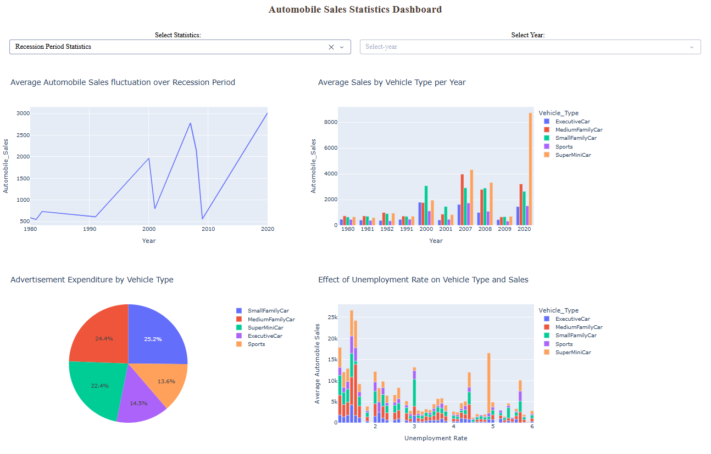
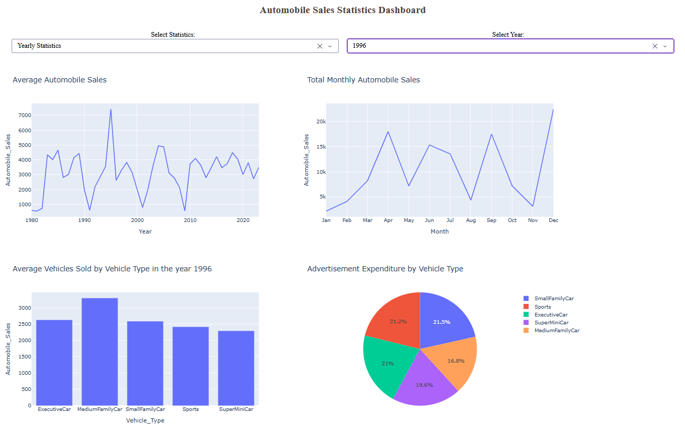

# Data Science Portfolio — IBM Professional Certificate Projects

This repository documents my transition from data analytics to data science, building on the **Google Data Analytics Certificate** program and advancing into Python, SQL, and Machine Learning through IBM.

## 🏛️ About Me

IT professional with experience managing the full SDLC for client-facing applications, now focused on applying data science to analyze real-world datasets, build predictive models, and deliver data-driven insights.

### 🚀 Featured Project: Interactive Automobile Sales Dashboard
[View Full Dash Application Code](./08-Data-Visualization-with-Python/Automobile-Sales-Part-2.py)  
Built a dynamic dashboard to analyze 30 years of automotive sales data, providing real-time insights into market volatility during recessionary periods.

| Recession Period Analysis | Yearly Trend Analysis |
| :---: | :---: |
|  |  |
| *Visualizing high-impact drops in vehicle sales during GDP contractions* | *Tracking long-term consumer growth and market recovery trends* |

### 📊 Current State
- **Status:** 🟠 In Progress (Target: Q2 2026)
- **Progress:** ████████---- 66% — 8 / 12 courses completed

### 🎓 Learning Path & Portfolio
- ✅ **Course 01:** What is Data Science (Completed: 2/26/2026)
- ✅ **Course 02:** Tools for Data Science (Completed: 2/28/2026)
- ✅ **Course 03:** [Data Science Methodology](./03-Data-Science-Methodology/Enterprise-Spam-Detection-Methodology.ipynb) (Completed: 3/3/2026)
- ✅ **Course 04:** Python for Data Science, AI & Development (Completed: 3/10/2026)
- ✅ **Course 05:** Python Project for Data Science (Completed: 3/12/2026)
- ✅ **Course 06:** Databases and SQL for Data Science with Python (Completed: 3/17/2026)
    - **Project:** [Chicago Public Schools Performance](./06-SQL-for-Data-Science/SQL-For-Data-Science-Final-Project.ipynb) — Conducted a SQL analysis on urban datasets to identify correlations between socioeconomic hardship indices and school safety scores
- ✅ **Course 07:** Data Analysis with Python (Completed: 3/26/2026)
    - **Project:** [Data Wrangling — Laptop Pricing Model](./07-Data-Analysis-with-Python/Data-Wrangling-Laptop-Pricing-Predictive-Model.ipynb) — Handling missing data, data standardization & normalization, binning, and indicator variables
    - **Project:** [Laptop Market Exploratory Data Analysis](./07-Data-Analysis-with-Python/Laptop-Market-Exploratory-Data-Analysis.ipynb) — Applying Pearson correlation and statistical visualization to identify key drivers of laptop pricing 
    - **Project:** [Predictive Modeling for Laptop Prices](./07-Data-Analysis-with-Python/Laptop-Price-Predictive-Modeling.ipynb) — Building regression models (SLR/MLR) and evaluating statistical significance (p-values) to forecast laptop prices
    - **Project:** [Model Evaluation and Refinement — Used Cars Pricing](./07-Data-Analysis-with-Python/Model-Evaluation-and-Refinement-Cars-Test-Case.ipynb) — Optimized pricing accuracy through Ridge regression and grid search hyperparameter tuning, validated with cross-validation and distribution analysis
    - **Project:** [Model Evaluation and Refinement — Laptop Pricing Model](./07-Data-Analysis-with-Python/Model-Evaluation-and-Refinement-Laptop-Pricing-Model.ipynb) — Evaluating polynomial models using cross-validation, R², Ridge regression, and grid search
    - **Project:** [Model Evaluation and Refinement — Insurance Cost Analysis](./07-Data-Analysis-with-Python/Model-Evaluation-and-Refinement-Insurance-Cost-Analysis.ipynb) — Executed a full data science pipeline — from wrangling and EDA to iterative model development and rigorous evaluation — to optimize insurance cost predictions
    - **Project:** [Model Evaluation and Refinement — House Pricing Model](./07-Data-Analysis-with-Python/Model-Evaluation-and-Refinement-House-Pricing.ipynb) — Engineered an end-to-end valuation pipeline — from multivariate EDA to iterative model refinement — to deliver high-accuracy house price predictions
- ✅ **Course 08:** Data Visualization with Python (Completed: 4/3/2026)
    - **Project:** [Advanced Visualizations — Immigration to Canada Case Study](./08-Data-Visualization-with-Python/Advanced-Visualizations-Canada-Immigration-Case-Study.ipynb) — Applying waffle charts and word clouds to visualize and identify migration trends to Canada
    - **Project:** [Final Assignment - Part 1 — Automobile Sales](./08-Data-Visualization-with-Python/Automobile-Sales-Part-1.ipynb) — Analyzing the impact of macroeconomic indicators on vehicle sales trends during historical recessionary and non-recessionary periods
    - **Project:** [Final Assignment - Part 2 — Automobile Sales](./08-Data-Visualization-with-Python/Automobile-Sales-Part-2.py) — Built a full-stack Dash application with Python to visualize 30 years of automotive sales data. Features dynamic callbacks for switching between Recession and Yearly statistics to track market volatility and consumer trends   [Recession Dashboard](./08-Data-Visualization-with-Python/images/RecessionDashboardGraphs.png) — [Yearly Dashboard](./08-Data-Visualization-with-Python/images/YearlyDashboardGraphs.png)
- 🟠 **Course 09:** Machine Learning with Python (Started: 4/6/2026 — Modules 1-4 Completed)
    - **Project:** [Risk Obesity Classification](./09-Machine-Learning-with-Python/obesity-risk-with-multi-class-classification.ipynb) — Built a pipeline to evaluate multi-class classification models to classify patients according to their obesity risk
    - **Project:** [Telecom Customer Classification](./09-Machine-Learning-with-Python/telecom-customer-classification-with-knn.ipynb) ([View Technical PDF Report](./09-Machine-Learning-with-Python/reports/telecom-customer-classification-with-knn.pdf)) — Developed a classification model using K-Nearest Neighbors (KNN) to predict customer service plans and optimized model performance through feature scaling (StandardScaler) and hyperparameter tuning to identify the optimal 'k' value 
- ⬜ **Course 10:** Applied Data Science Capstone
- ⬜ **Course 11:** Generative AI: Elevate Your Data Science Career
- ⬜ **Course 12:** Data Scientist Career Guide and Interview Preparation

### 🛠 Tools & Tech
- **Languages:** `Python` (Intermediate / Data Analysis Focus), `SQL` (Advanced Querying), `R` (foundational)
- **Libraries:** `Pandas`, `NumPy`, `scikit-learn`, `SciPy`
- **Data Wrangling:** ETL Pipelines, Missing Value Imputation, Data Normalization & Standardization, Feature Engineering
- **Exploratory Data Analysis (EDA):** Statistical Profiling, `Pearson correlation`, and `p-value` significance testing
- **Model Development & Evaluation:** `Linear Regression`, `Polynomial Regression`, `Ridge Regression`, `Cross-Validation`, `Grid Search`, `Pipelines`, `KNN Classification`, `MSE`, `R-squared`
- **Data Viz:** `Matplotlib`, `Seaborn`, `Folium`, `Plotly`, `Dash`
- **New for 2026:** Generative AI for Data Science & Watsonx.ai

